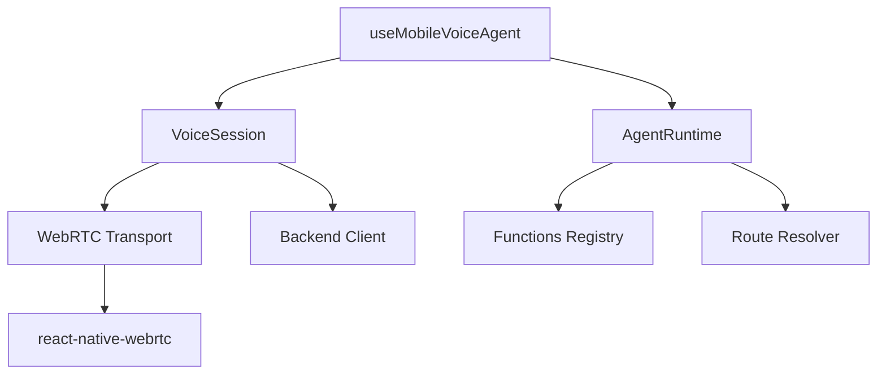

## Overview

The `@navai/voice-mobile` package provides a complete voice AI solution for React Native applications. It handles WebRTC connections, realtime communication with OpenAI's Realtime API, and integrates seamlessly with React Native navigation and application functions.

## Installation

```bash
npm install @navai/voice-mobile react-native-webrtc
```

## Quick Start

```tsx
import { useMobileVoiceAgent } from '@navai/voice-mobile';
import { useNavigation } from '@react-navigation/native';

function VoiceButton() {
  const navigation = useNavigation();
  const { start, stop, isConnected, error } = useMobileVoiceAgent({
    runtime,
    runtimeLoading: false,
    runtimeError: null,
    navigate: (path) => navigation.navigate(path)
  });

  return (
    <Button onPress={isConnected ? stop : start}>
      {isConnected ? 'Stop' : 'Start'} Voice
    </Button>
  );
}
```

## Core Features

### React Native Integration

- WebRTC audio streaming via `react-native-webrtc`
- Automatic microphone permission handling (Android)
- React Navigation integration
- Mobile-optimized session management

### Voice Agent Runtime

- Function calling with mobile and backend functions
- Route-based navigation commands
- Automatic tool execution and response handling
- Context-aware instruction generation

### WebRTC Transport

- OpenAI Realtime API WebRTC connection
- Configurable audio constraints
- Remote audio volume control
- Connection state management

## Architecture



## Package Exports

### Hooks

- [`useMobileVoiceAgent`](/api/mobile/use-mobile-voice-agent) - Main React hook for voice integration

### Core APIs

- [`createNavaiMobileAgentRuntime`](/api/mobile/agent-runtime) - Create agent runtime with tools
- [`createNavaiMobileBackendClient`](/api/mobile/backend-client) - Backend API client
- [`createReactNativeWebRtcTransport`](/api/mobile/webrtc-transport) - WebRTC transport layer
- `createNavaiMobileVoiceSession` - Voice session manager

### Utilities

- `loadNavaiFunctions` - Load and register mobile functions
- `resolveNavaiRoute` - Resolve route paths from names
- `extractNavaiRealtimeToolCalls` - Extract tool calls from events
- `buildNavaiRealtimeToolResultEvents` - Build tool result events

### Configuration

- `resolveNavaiMobileApplicationRuntimeConfig` - Resolve app runtime config
- `resolveNavaiMobileRuntimeConfig` - Resolve runtime configuration
- `resolveNavaiMobileEnv` - Resolve environment variables

## Type Exports

See [Types Reference](/api/mobile/types) for complete type documentation.

## Platform Support

- iOS 11.0+
- Android API 21+
- React Native 0.60+

## Dependencies

- `react-native-webrtc` - WebRTC support (peer dependency)
- `react` and `react-native` - React Native framework (peer dependencies)

## Next Steps

<CardGroup cols={2}>
  <Card title="useMobileVoiceAgent Hook" icon="react" href="/api/mobile/use-mobile-voice-agent">
    Main React hook for voice integration
  </Card>
  <Card title="Agent Runtime" icon="microchip" href="/api/mobile/agent-runtime">
    Create and configure agent runtime
  </Card>
  <Card title="WebRTC Transport" icon="tower-broadcast" href="/api/mobile/webrtc-transport">
    WebRTC transport configuration
  </Card>
  <Card title="Types Reference" icon="code" href="/api/mobile/types">
    TypeScript types and interfaces
  </Card>
</CardGroup>
