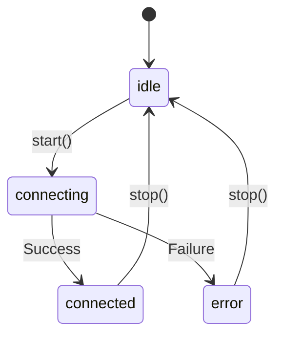

## Overview

The `useMobileVoiceAgent` hook provides a complete voice agent implementation for React Native applications. It manages WebRTC connections, handles tool calls, and integrates with your app's navigation and functions.

## Import

```tsx
import { useMobileVoiceAgent } from '@navai/voice-mobile';
```

## Usage

```tsx
import { useMobileVoiceAgent } from '@navai/voice-mobile';
import { useNavigation } from '@react-navigation/native';

function VoiceControl() {
  const navigation = useNavigation();
  const { start, stop, isConnected, isConnecting, status, error } = useMobileVoiceAgent({
    runtime,
    runtimeLoading: false,
    runtimeError: null,
    navigate: (path) => navigation.navigate(path)
  });

  if (error) {
    return <Text>Error: {error}</Text>;
  }

  return (
    <View>
      <Text>Status: {status}</Text>
      <Button 
        onPress={isConnected ? stop : start}
        disabled={isConnecting}
      >
        {isConnected ? 'Stop Voice' : 'Start Voice'}
      </Button>
    </View>
  );
}
```

## Type Signature

```tsx
function useMobileVoiceAgent(
  options: UseMobileVoiceAgentOptions
): UseMobileVoiceAgentResult
```

## Parameters

<ParamField path="options" type="UseMobileVoiceAgentOptions" required>
  Configuration options for the voice agent

  <Expandable title="properties">
    <ParamField path="runtime" type="ResolveNavaiMobileApplicationRuntimeConfigResult | null" required>
      Runtime configuration including routes, functions, and API settings. Pass `null` if not yet loaded.
    </ParamField>

    <ParamField path="runtimeLoading" type="boolean" required>
      Whether the runtime configuration is currently loading. Set to `true` while loading, `false` when ready.
    </ParamField>

    <ParamField path="runtimeError" type="string | null" required>
      Runtime configuration error message, or `null` if no error.
    </ParamField>

    <ParamField path="navigate" type="(path: string) => void" required>
      Navigation function called when the agent executes navigation commands. Typically from React Navigation:
      ```tsx
      navigate: (path) => navigation.navigate(path)
      ```
    </ParamField>
  </Expandable>
</ParamField>

## Return Value

<ResponseField name="status" type="'idle' | 'connecting' | 'connected' | 'error'">
  Current session status:
  - `idle` - Not connected, ready to start
  - `connecting` - Connection in progress
  - `connected` - Active voice session
  - `error` - Connection or execution error
</ResponseField>

<ResponseField name="error" type="string | null">
  Error message if status is `error`, otherwise `null`.
</ResponseField>

<ResponseField name="isConnecting" type="boolean">
  Convenience flag: `true` when status is `connecting`.
</ResponseField>

<ResponseField name="isConnected" type="boolean">
  Convenience flag: `true` when status is `connected`.
</ResponseField>

<ResponseField name="start" type="() => Promise<void>">
  Start the voice session. This will:
  1. Request microphone permissions (Android)
  2. Load WebRTC native module
  3. Initialize WebRTC connection
  4. Configure agent runtime with tools
  5. Begin listening for voice input

  **Throws** if already connecting/connected, or if configuration is invalid.
</ResponseField>

<ResponseField name="stop" type="() => Promise<void>">
  Stop the voice session and clean up resources. Safe to call multiple times.
</ResponseField>

## Behavior

### Session Lifecycle



### Microphone Permissions

On Android, the hook automatically requests `RECORD_AUDIO` permission when `start()` is called. Permission states:

- **Granted**: Session starts normally
- **Denied**: Error with message to retry
- **Never Ask Again**: Error with message to enable in settings

### Tool Call Handling

The hook automatically handles all realtime tool calls:

1. **Navigation Commands**: Calls `navigate()` with resolved route path
2. **Mobile Functions**: Executes registered frontend functions
3. **Backend Functions**: Calls backend API to execute functions
4. **Tool Results**: Sends results back to realtime session

### WebRTC Configuration

The hook uses default WebRTC settings:
- Audio constraints: `{ audio: true, video: false }`
- Remote audio volume: `10` (maximum)
- Model: From runtime config or `gpt-realtime`

## Examples

### Basic Integration

```tsx
import { useMobileVoiceAgent } from '@navai/voice-mobile';
import { useNavigation } from '@react-navigation/native';

function VoiceButton() {
  const navigation = useNavigation();
  const { start, stop, isConnected } = useMobileVoiceAgent({
    runtime,
    runtimeLoading: false,
    runtimeError: null,
    navigate: (path) => navigation.navigate(path)
  });

  return (
    <TouchableOpacity onPress={isConnected ? stop : start}>
      <Text>{isConnected ? 'Stop' : 'Start'} Voice</Text>
    </TouchableOpacity>
  );
}
```

### With Loading State

```tsx
import { useMobileVoiceAgent } from '@navai/voice-mobile';
import { useRuntimeConfig } from './hooks/useRuntimeConfig';

function VoiceControl() {
  const navigation = useNavigation();
  const { runtime, loading, error: configError } = useRuntimeConfig();
  
  const { 
    start, 
    stop, 
    isConnected, 
    isConnecting, 
    error: sessionError 
  } = useMobileVoiceAgent({
    runtime,
    runtimeLoading: loading,
    runtimeError: configError,
    navigate: (path) => navigation.navigate(path)
  });

  const displayError = configError || sessionError;

  if (loading) {
    return <ActivityIndicator />;
  }

  return (
    <View>
      {displayError && <Text style={styles.error}>{displayError}</Text>}
      <Button 
        onPress={isConnected ? stop : start}
        disabled={isConnecting || loading}
      >
        {isConnecting ? 'Connecting...' : isConnected ? 'Stop' : 'Start'}
      </Button>
    </View>
  );
}
```

### With Status Indicator

```tsx
function VoiceStatusIndicator() {
  const { status, isConnected, start, stop } = useMobileVoiceAgent(options);

  const getStatusColor = () => {
    switch (status) {
      case 'connected': return 'green';
      case 'connecting': return 'yellow';
      case 'error': return 'red';
      default: return 'gray';
    }
  };

  return (
    <View style={styles.container}>
      <View style={[styles.indicator, { backgroundColor: getStatusColor() }]} />
      <Text>{status}</Text>
      <Button onPress={isConnected ? stop : start}>
        {isConnected ? 'Disconnect' : 'Connect'}
      </Button>
    </View>
  );
}
```

## Error Handling

Common errors and solutions:

| Error | Cause | Solution |
|-------|-------|----------|
| "WebRTC native module is not available" | `react-native-webrtc` not installed | Install and link `react-native-webrtc` |
| "Runtime is still loading" | Called `start()` while `runtimeLoading: true` | Wait for runtime to load |
| "Microphone permission denied" | User denied permission | Request user to retry |
| "Microphone permission blocked" | User selected "Never Ask Again" | Direct user to system settings |
| "Functions are still loading" | Functions not ready | Wait for initialization |
| "Realtime WebRTC negotiation failed" | Network or auth error | Check API URL and credentials |

## Implementation Notes

### Internal State

The hook maintains several refs to manage state across renders:
- `sessionRef` - Voice session instance
- `agentRuntimeRef` - Agent runtime with tools
- `frontendRegistryRef` - Loaded function registry
- `handledToolCallIdsRef` - Prevents duplicate tool execution
- `toolCallNamesByIdRef` - Maps call IDs to function names
- `pendingToolCallsRef` - Queues early tool calls

### Cleanup

The hook automatically cleans up on unmount:
- Stops voice session
- Clears all refs
- Cancels pending operations

### Performance

Function loading is memoized and only runs when `runtime` changes. Tool call handlers use `useCallback` to prevent unnecessary re-renders.

## See Also

- [Agent Runtime API](/api/mobile/agent-runtime) - Runtime configuration
- [WebRTC Transport](/api/mobile/webrtc-transport) - Transport layer
- [Types Reference](/api/mobile/types) - TypeScript types
