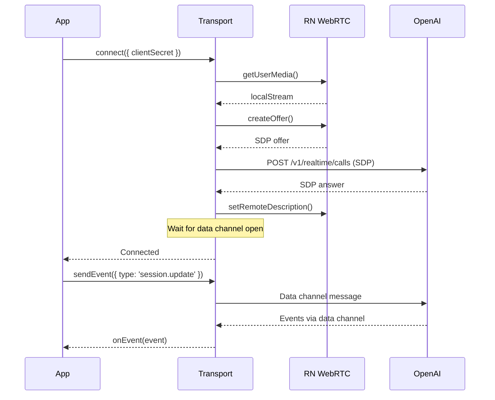

## Overview

`createReactNativeWebRtcTransport` creates a WebRTC transport for connecting to OpenAI's Realtime API from React Native applications. It handles peer connection setup, audio streaming, and data channel management.

## Import

```tsx
import { createReactNativeWebRtcTransport } from '@navai/voice-mobile';
```

## Usage

```tsx
import { createReactNativeWebRtcTransport } from '@navai/voice-mobile';
import { mediaDevices, RTCPeerConnection } from 'react-native-webrtc';

const transport = createReactNativeWebRtcTransport({
  globals: {
    mediaDevices,
    RTCPeerConnection
  },
  model: 'gpt-4o-realtime-preview-2024-12-17',
  remoteAudioTrackVolume: 8
});

// Connect to realtime API
await transport.connect({
  clientSecret: 'client_secret_...',
  onEvent: (event) => console.log('Event:', event),
  onError: (error) => console.error('Error:', error)
});

// Send events
await transport.sendEvent({
  type: 'session.update',
  session: { instructions: 'You are a helpful assistant' }
});

// Disconnect
await transport.disconnect();
```

## Type Signature

```tsx
function createReactNativeWebRtcTransport(
  options: CreateReactNativeWebRtcTransportOptions
): NavaiRealtimeTransport
```

## Parameters

<ParamField path="options" type="CreateReactNativeWebRtcTransportOptions" required>
  Configuration options for the WebRTC transport

  <Expandable title="properties">
    <ParamField path="globals" type="NavaiReactNativeWebRtcGlobals" required>
      WebRTC globals from `react-native-webrtc`:
      ```tsx
      import { mediaDevices, RTCPeerConnection } from 'react-native-webrtc';
      
      {
        mediaDevices,
        RTCPeerConnection
      }
      ```
    </ParamField>

    <ParamField path="model" type="string">
      Default model for realtime API. Default: `gpt-realtime`
      
      Can be overridden in `connect()` options.
    </ParamField>

    <ParamField path="realtimeUrl" type="string">
      OpenAI Realtime API URL. Default: `https://api.openai.com/v1/realtime/calls`
    </ParamField>

    <ParamField path="remoteAudioTrackVolume" type="number">
      Remote audio track volume (0-10). Default: `10` (maximum)
      
      Uses React Native WebRTC's `_setVolume()` method.
    </ParamField>

    <ParamField path="rtcConfiguration" type="unknown">
      Custom RTC configuration for peer connection.
    </ParamField>

    <ParamField path="audioConstraints" type="unknown">
      Audio constraints for `getUserMedia()`. Default: `{ audio: true, video: false }`
    </ParamField>

    <ParamField path="fetchImpl" type="typeof fetch">
      Custom fetch implementation. Default: global `fetch`
    </ParamField>
  </Expandable>
</ParamField>

## Return Value

<ResponseField name="connect" type="(options: NavaiRealtimeTransportConnectOptions) => Promise<void>">
  Connect to OpenAI Realtime API via WebRTC.

  <Expandable title="parameters">
    <ParamField path="options.clientSecret" type="string" required>
      Ephemeral client secret from backend
    </ParamField>

    <ParamField path="options.model" type="string">
      Model to use (overrides default from constructor)
    </ParamField>

    <ParamField path="options.onEvent" type="(event: unknown) => void">
      Event handler for realtime events
    </ParamField>

    <ParamField path="options.onError" type="(error: unknown) => void">
      Error handler for connection errors
    </ParamField>
  </Expandable>

  **Throws** if already connecting/connected, or if WebRTC setup fails.
</ResponseField>

<ResponseField name="disconnect" type="() => Promise<void>">
  Disconnect and clean up all resources. Safe to call multiple times.
</ResponseField>

<ResponseField name="sendEvent" type="(event: unknown) => Promise<void>">
  Send an event to the realtime API.
  
  Accepts object (auto-serializes to JSON) or string.
  
  **Throws** if data channel is not open.
</ResponseField>

<ResponseField name="getState" type="() => NavaiRealtimeTransportState">
  Get current transport state:
  - `idle` - Not connected
  - `connecting` - Connection in progress
  - `connected` - Active connection
  - `error` - Connection error
  - `closed` - Disconnected
</ResponseField>

## Connection Flow



## WebRTC Configuration

### Audio Constraints

Default audio constraints:
```tsx
{
  audio: true,
  video: false
}
```

Custom constraints:
```tsx
const transport = createReactNativeWebRtcTransport({
  globals,
  audioConstraints: {
    audio: {
      echoCancellation: true,
      noiseSuppression: true,
      autoGainControl: true
    },
    video: false
  }
});
```

### RTC Configuration

Custom RTC configuration (STUN/TURN servers):
```tsx
const transport = createReactNativeWebRtcTransport({
  globals,
  rtcConfiguration: {
    iceServers: [
      { urls: 'stun:stun.l.google.com:19302' },
      {
        urls: 'turn:turn.example.com:3478',
        username: 'user',
        credential: 'pass'
      }
    ]
  }
});
```

### Remote Audio Volume

Control remote audio volume (0-10):
```tsx
const transport = createReactNativeWebRtcTransport({
  globals,
  remoteAudioTrackVolume: 8 // 80% volume
});
```

Volume is applied to:
- Audio tracks from `ontrack` events
- All receivers' tracks

## Examples

### Basic Usage

```tsx
import { createReactNativeWebRtcTransport } from '@navai/voice-mobile';
import { mediaDevices, RTCPeerConnection } from 'react-native-webrtc';

const transport = createReactNativeWebRtcTransport({
  globals: { mediaDevices, RTCPeerConnection }
});

await transport.connect({
  clientSecret,
  onEvent: (event) => {
    if (event.type === 'response.audio_transcript.delta') {
      console.log('Transcript:', event.delta);
    }
  },
  onError: (error) => {
    console.error('Transport error:', error);
  }
});

await transport.sendEvent({
  type: 'session.update',
  session: {
    instructions: 'You are a helpful assistant.'
  }
});
```

### With State Tracking

```tsx
const transport = createReactNativeWebRtcTransport({ globals });
const [state, setState] = useState('idle');

const connect = async () => {
  try {
    setState('connecting');
    await transport.connect({
      clientSecret,
      onEvent: handleEvent,
      onError: handleError
    });
    setState(transport.getState());
  } catch (error) {
    setState('error');
  }
};
```

### Custom Model and URL

```tsx
const transport = createReactNativeWebRtcTransport({
  globals,
  model: 'gpt-4o-realtime-preview-2024-12-17',
  realtimeUrl: 'https://api.openai.com/v1/realtime/calls'
});

await transport.connect({
  clientSecret,
  model: 'gpt-4o-mini-realtime-preview' // Override default
});
```

### Event Processing

```tsx
await transport.connect({
  clientSecret,
  onEvent: (event) => {
    // Events are auto-parsed from JSON
    switch (event.type) {
      case 'session.created':
        console.log('Session created');
        break;
      case 'conversation.item.created':
        console.log('Item created:', event.item);
        break;
      case 'error':
        console.error('Realtime error:', event.error);
        break;
    }
  },
  onError: (error) => {
    // Connection-level errors
    console.error('Transport error:', error);
  }
});
```

### Clean Disconnect

```tsx
useEffect(() => {
  return () => {
    // Clean up on unmount
    transport.disconnect();
  };
}, []);

const handleStop = async () => {
  try {
    await transport.disconnect();
    console.log('Disconnected');
  } catch (error) {
    console.error('Disconnect error:', error);
  }
};
```

## Implementation Details

### Data Channel

The transport creates a data channel named `"oai-events"` for bidirectional communication:

- **Incoming**: Events are auto-parsed from JSON strings
- **Outgoing**: Objects are auto-serialized to JSON
- **Timeout**: 12 seconds for initial connection, 6 seconds for send operations

### Connection State Monitoring

The transport monitors WebRTC connection state:

```tsx
peerConnection.onconnectionstatechange = () => {
  if (state === 'failed' || state === 'disconnected') {
    onError(new Error(`WebRTC connection state: ${state}`));
  }
};
```

### Audio Track Management

Local audio tracks:
- Obtained via `getUserMedia()`
- Added to peer connection
- Stopped on disconnect

Remote audio tracks:
- Received via `ontrack` events
- Volume applied automatically
- Extracted from receivers

### Error Handling

Errors are normalized to readable messages:

```tsx
function toErrorMessage(error: unknown): string {
  if (error instanceof Error) return error.message;
  if (typeof error === 'string') return error;
  if (error?.code && error?.message) return `${code}: ${message}`;
  // ... more cases
}
```

## Timeouts

| Operation | Timeout | Configurable |
|-----------|---------|-------------|
| Data channel connect | 12 seconds | No |
| Send event | 6 seconds | No |
| WebRTC negotiation | None (fetch default) | Via fetchImpl |

## Platform Considerations

### iOS

- Requires microphone permissions in `Info.plist`:
  ```xml
  <key>NSMicrophoneUsageDescription</key>
  <string>Voice assistant needs microphone access</string>
  ```

### Android

- Requires `RECORD_AUDIO` permission in `AndroidManifest.xml`:
  ```xml
  <uses-permission android:name="android.permission.RECORD_AUDIO" />
  ```
- Runtime permission handled by `useMobileVoiceAgent` hook

## Best Practices

1. **Error Handling**: Always provide both `onEvent` and `onError` handlers
2. **Cleanup**: Call `disconnect()` in component cleanup (useEffect return)
3. **Volume**: Start with lower volume (6-8) and adjust based on user feedback
4. **State**: Use `getState()` to check connection status before sending events
5. **Retries**: Implement exponential backoff for reconnection logic

## Troubleshooting

| Issue | Possible Cause | Solution |
|-------|----------------|----------|
| "WebRTC native module is not available" | `react-native-webrtc` not linked | Run pod install / gradle sync |
| "No audio tracks returned" | Microphone permission denied | Check permissions |
| "Data channel is not open" | Sent event before connection complete | Wait for `connected` state |
| "WebRTC connection state: failed" | Network issue | Check network connectivity |
| No audio output | Volume too low or muted | Increase `remoteAudioTrackVolume` |

## See Also

- [useMobileVoiceAgent Hook](/api/mobile/use-mobile-voice-agent) - Main integration hook
- [Types Reference](/api/mobile/types) - Transport type definitions
- [OpenAI Realtime API](https://platform.openai.com/docs/guides/realtime) - Official documentation
