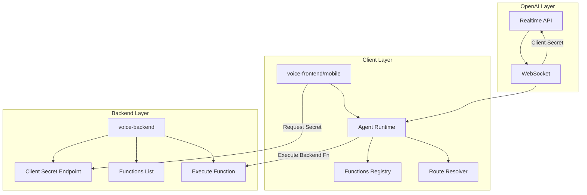

## Overview

NAVAI implements a **three-layer architecture** that separates concerns between backend security, client-side execution, and OpenAI's Realtime API. This design ensures secure credential management while enabling powerful voice-driven interactions.



## Three-Layer Architecture

### 1. Backend Layer (`voice-backend`)

**Purpose**: Secure credential management and backend function execution

**Key Components**:

- **Client Secret Handler** (`~/workspace/source/packages/voice-backend/src/index.ts:160-205`)
  - Creates ephemeral client secrets via OpenAI's `/v1/realtime/client_secrets` endpoint
  - Configures session with model, voice, and instructions
  - Enforces TTL between 10-7200 seconds (default 600s)

- **Runtime Configuration** (`~/workspace/source/packages/voice-backend/src/runtime.ts:35-74`)
  - Scans filesystem for function modules
  - Supports glob patterns for discovery: `src/ai/functions-modules/...`
  - Excludes `node_modules`, `dist`, and hidden directories

- **Functions Registry** (`~/workspace/source/packages/voice-backend/src/functions.ts:278-320`)
  - Dynamically loads function modules
  - Normalizes names (e.g., `myFunction` → `my_function`)
  - Handles exports: default functions, named exports, classes, objects

**Express Routes**:

```typescript
// Default paths (configurable)
POST /navai/realtime/client-secret  // Create client secret
GET  /navai/functions                // List available functions
POST /navai/functions/execute        // Execute backend function
```

<Info>
The backend **never stores** the OpenAI API key in client secrets. It uses the key only to request ephemeral credentials that expire automatically.
</Info>

### 2. Client Layer (`voice-frontend` / `voice-mobile`)

**Purpose**: Execute frontend functions and manage voice interactions

**Key Components**:

- **Agent Builder** (`~/workspace/source/packages/voice-frontend/src/agent.ts:47-251`)
  - Loads local function modules via `loadNavaiFunctions()`
  - Merges backend function definitions
  - Creates tools: `navigate_to`, `execute_app_function`, and direct function aliases
  - Generates dynamic instructions from routes and functions

- **Runtime Resolver** (`~/workspace/source/packages/voice-frontend/src/runtime.ts:44-85`)
  - Resolves route modules from `src/ai/routes.ts` (default)
  - Discovers function modules matching configured patterns
  - Supports environment overrides: `NAVAI_ROUTES_FILE`, `NAVAI_FUNCTIONS_FOLDERS`

- **Route Resolution** (`~/workspace/source/packages/voice-frontend/src/routes.ts:16-33`)
  - Matches routes by path, name, or synonyms
  - Normalizes Unicode for multilingual support
  - Uses fuzzy matching (contains) as fallback

**Mobile Differences**:

The mobile package (`voice-mobile`) implements the same agent logic but:
- Returns raw tool definitions instead of RealtimeAgent instance
- Provides `extractNavaiRealtimeToolCalls()` for parsing OpenAI events
- Uses WebRTC transport instead of WebSocket

### 3. OpenAI Realtime Layer

**Purpose**: Natural language understanding and voice synthesis

**Interaction Flow**:

1. Client requests client secret from backend
2. Client connects to OpenAI Realtime API with ephemeral token
3. OpenAI streams audio input/output and function calls
4. Client executes tool calls locally or via backend
5. Results are sent back to continue conversation

<Warning>
Client secrets expire after configured TTL. Applications must handle reconnection by requesting new secrets before expiration.
</Warning>

## Component Interactions

### Client Secret Lifecycle

```typescript
// 1. Backend creates secret (index.ts:160-205)
export async function createRealtimeClientSecret(
  opts: NavaiVoiceBackendOptions,
  req?: CreateClientSecretRequest
): Promise<OpenAIRealtimeClientSecretResponse> {
  // Validates API key (server key or request key)
  const apiKey = resolveApiKey(opts, req);
  
  // Configures session with model, voice, instructions
  const body = {
    expires_after: { anchor: "created_at", seconds: ttl },
    session: {
      type: "realtime",
      model: req?.model ?? opts.defaultModel ?? "gpt-realtime",
      instructions: buildSessionInstructions({...}),
      audio: { output: { voice } }
    }
  };
  
  // Fetches ephemeral token from OpenAI
  const response = await fetch(OPENAI_CLIENT_SECRETS_URL, {...});
  return response.json(); // { value, expires_at }
}
```

**Security Model**:

- Server API key stays on backend, never sent to client
- Client receives time-limited token (10s - 2h)
- Optional: Allow client-provided API keys with `allowApiKeyFromRequest: true`

### Function Discovery and Loading

**Backend Process** (`runtime.ts:76-84`):

```typescript
async function scanModules(
  baseDir: string,
  extensions: string[],
  exclude: string[]
): Promise<IndexedModule[]> {
  // Walks directory tree from baseDir
  // Filters by extensions: ["ts", "js", "mjs", "cjs", "mts", "cts"]
  // Excludes: node_modules, dist, .* directories
  // Returns { absPath, rawPath, normalizedPath }
}
```

**Function Registration** (`functions.ts:278-320`):

```typescript
export async function loadNavaiFunctions(
  functionModuleLoaders: NavaiFunctionModuleLoaders
): Promise<NavaiFunctionsRegistry> {
  // Iterates module loaders sorted by path
  // Extracts exports: default, named functions, classes, objects
  // Normalizes names: CamelCase → snake_case
  // Returns { byName: Map, ordered: Array, warnings: [] }
}
```

**Name Normalization**:

- `myFunction` → `my_function`
- `MyClass.doAction` → `my_class_do_action`
- Duplicates get numbered: `my_function_2`, `my_function_3`

### Tool Execution Flow

**Frontend Agent** (`agent.ts:108-163`):

```typescript
const executeAppFunction = async (
  requestedName: string,
  payload: Record<string, unknown> | null
) => {
  // 1. Check frontend registry
  const frontendDefinition = functionsRegistry.byName.get(requested);
  if (frontendDefinition) {
    const result = await frontendDefinition.run(payload ?? {}, options);
    return { ok: true, function_name, source, result };
  }
  
  // 2. Check backend registry
  const backendDefinition = backendFunctionsByName.get(requested);
  if (backendDefinition && options.executeBackendFunction) {
    const result = await options.executeBackendFunction({
      functionName,
      payload: payload ?? null
    });
    return { ok: true, function_name, source: "backend", result };
  }
  
  // 3. Unknown function
  return { ok: false, error: "Unknown function", available_functions };
};
```

**Mobile Agent** (`~/workspace/source/packages/voice-mobile/src/agent.ts:272-356`):

Similar logic but handles tool calls from parsed OpenAI events:

```typescript
if (toolName === "navigate_to") {
  return executeNavigateTool(input.payload);
}

if (toolName === "execute_app_function") {
  return executeFunctionTool(input.payload);
}

// Graceful fallback: direct function name as tool
if (availableFunctionNames.includes(toolName)) {
  return executeFunctionTool({
    function_name: toolName,
    payload: input.payload ?? null
  });
}
```

## Design Principles

### Separation of Concerns

- **Backend**: Security, credentials, privileged operations
- **Client**: UI navigation, local state, user context
- **OpenAI**: NLU, voice processing, conversation management

### Zero Configuration

- Automatically discovers functions from `src/ai/functions-modules/`
- Default routes from `src/ai/routes.ts`
- Override via environment variables or options

### Type Safety

- Full TypeScript support across all layers
- Exported types for all registries and definitions
- Runtime validation for function payloads

### Extensibility

- Custom function loaders via glob patterns
- Pluggable transport layer (WebSocket/WebRTC)
- Custom route resolution logic

## Common Patterns

### Hybrid Function Distribution

```typescript
// Frontend: UI actions, navigation, local state
export function showNotification(message: string) {
  toast.success(message);
}

// Backend: Database queries, API calls, authentication
export async function getUserProfile(userId: string) {
  return await db.users.findById(userId);
}
```

### Context Passing

```typescript
// Functions receive context with navigate, request, etc.
export function goHome(_payload: unknown, context: NavaiFunctionContext) {
  context.navigate("/");
}
```

### Class-Based Functions

```typescript
// Each method becomes a separate tool: calculator_add, calculator_subtract
export class Calculator {
  add(a: number, b: number) { return a + b; }
  subtract(a: number, b: number) { return a - b; }
}
```

## Performance Considerations

- Function modules loaded lazily on first request
- Registry cached after initial scan
- Tool schemas generated once at agent initialization
- Client secrets reused until expiration

## Next Steps

<CardGroup cols={2}>
  <Card title="Voice Interaction" icon="microphone" href="/concepts/voice-interaction">
    Learn how voice flows through the system
  </Card>
  <Card title="Function Execution" icon="code" href="/concepts/function-execution">
    Deep dive into function loading and invocation
  </Card>
  <Card title="UI Navigation" icon="route" href="/concepts/ui-navigation">
    Understand voice-driven navigation
  </Card>
  <Card title="API Reference" icon="book" href="/api/backend/overview">
    Explore type definitions and interfaces
  </Card>
</CardGroup>