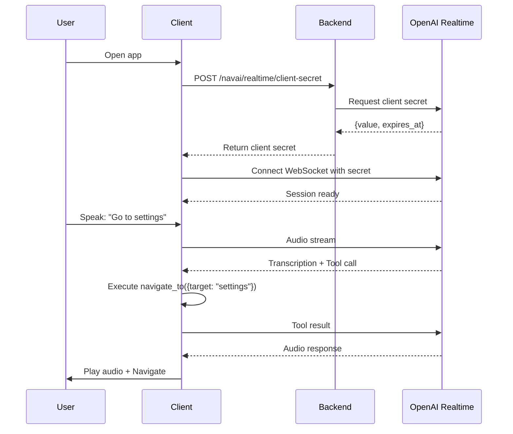

## Overview

NAVAI leverages **OpenAI's Realtime API** to provide natural voice interactions in web and mobile applications. The system handles bidirectional audio streaming, function calling, and session management through ephemeral client secrets.

## Architecture Flow



## Client Secret Lifecycle

### 1. Requesting a Client Secret

The backend generates ephemeral credentials for secure OpenAI access:

```typescript
// Backend: index.ts:160-205
export async function createRealtimeClientSecret(
  opts: NavaiVoiceBackendOptions,
  req?: CreateClientSecretRequest
): Promise<OpenAIRealtimeClientSecretResponse> {
  const apiKey = resolveApiKey(opts, req);
  const model = req?.model ?? opts.defaultModel ?? "gpt-realtime";
  const voice = req?.voice ?? opts.defaultVoice ?? "marin";
  const ttl = opts.clientSecretTtlSeconds ?? 600; // 10 minutes default
  
  const body = {
    expires_after: { anchor: "created_at", seconds: ttl },
    session: {
      type: "realtime",
      model,
      instructions: buildSessionInstructions({...}),
      audio: { output: { voice } }
    }
  };
  
  const response = await fetch(
    "https://api.openai.com/v1/realtime/client_secrets",
    {
      method: "POST",
      headers: {
        Authorization: `Bearer ${apiKey}`,
        "Content-Type": "application/json"
      },
      body: JSON.stringify(body)
    }
  );
  
  return response.json(); // { value, expires_at, session }
}
```

**Configuration Options**:

- `model`: Realtime model (default: `"gpt-realtime"`)
- `voice`: OpenAI voice (default: `"marin"`, options: `"ash"`, `"ballad"`, `"coral"`, `"sage"`, `"verse"`)
- `instructions`: System prompt with route/function context
- `language`: Response language (e.g., `"Spanish"`, `"French"`)
- `voiceAccent`: Accent instruction (e.g., `"British"`, `"Australian"`)
- `voiceTone`: Tone instruction (e.g., `"friendly"`, `"professional"`)

<Info>
Client secrets are **ephemeral tokens** that expire after the configured TTL (10s - 2h). They grant access only to the Realtime API, not your full OpenAI account.
</Info>

### 2. Session Instructions

The backend builds dynamic instructions from routes and functions:

```typescript
// Backend: index.ts:134-158
function buildSessionInstructions(input: {
  baseInstructions: string;
  language?: string;
  voiceAccent?: string;
  voiceTone?: string;
}): string {
  const lines = [input.baseInstructions.trim()];
  
  if (input.language) {
    lines.push(`Always reply in ${input.language}.`);
  }
  
  if (input.voiceAccent) {
    lines.push(`Use a ${input.voiceAccent} accent while speaking.`);
  }
  
  if (input.voiceTone) {
    lines.push(`Use a ${input.voiceTone} tone while speaking.`);
  }
  
  return lines.join("\n");
}
```

**Frontend Agent Instructions** (`agent.ts:228-242`):

```typescript
const instructions = [
  options.baseInstructions ?? "You are a voice assistant embedded in a web app.",
  "Allowed routes:",
  ...routeLines, // - home (/), aliases: inicio, main
  "Allowed app functions:",
  ...functionLines, // - show_notification: Display a toast message
  "Rules:",
  "- If user asks to go/open a section, always call navigate_to.",
  "- If user asks to run an internal action, call execute_app_function.",
  "- Always include payload. Use null when no arguments are needed.",
  "- Never invent routes or function names that are not listed.",
  "- If destination/action is unclear, ask a brief clarifying question."
].join("\n");
```

### 3. TTL and Expiration

```typescript
// Backend: index.ts:77-82
const MIN_TTL_SECONDS = 10;
const MAX_TTL_SECONDS = 7200; // 2 hours
const DEFAULT_TTL = 600; // 10 minutes

if (ttl < MIN_TTL_SECONDS || ttl > MAX_TTL_SECONDS) {
  throw new Error(
    `clientSecretTtlSeconds must be between ${MIN_TTL_SECONDS} and ${MAX_TTL_SECONDS}`
  );
}
```

**Best Practices**:

- **Short sessions** (5-10 min): Use low TTL for security
- **Long sessions** (30-60 min): Implement refresh logic before expiration
- **Mobile apps**: Request new secret on app resume

<Warning>
Clients must handle expiration by requesting a new secret **before** the current one expires. The `expires_at` timestamp indicates when reconnection is needed.
</Warning>

## Connecting to OpenAI Realtime

### Web (Frontend)

The `voice-frontend` package uses `@openai/agents/realtime`:

```typescript
import { RealtimeAgent } from "@openai/agents/realtime";
import { buildNavaiAgent } from "@navai/voice-frontend";

const { agent } = await buildNavaiAgent({
  routes: ROUTES,
  functionModuleLoaders: FUNCTION_MODULES,
  navigate: (path) => router.push(path),
  baseInstructions: "You are a helpful shopping assistant."
});

// Connect with client secret
await agent.connect({
  clientSecret: "secret_value_from_backend"
});
```

### Mobile (React Native)

The `voice-mobile` package provides raw tool definitions for WebRTC:

```typescript
import { createNavaiMobileAgentRuntime } from "@navai/voice-mobile";
import { NavaiRealtimeTransport } from "./transport";

const runtime = createNavaiMobileAgentRuntime({
  routes: ROUTES,
  functionsRegistry: await loadNavaiFunctions(modules),
  navigate: (path) => navigation.navigate(path),
  baseInstructions: "You are a mobile shopping assistant."
});

// Use custom transport (WebRTC)
const transport: NavaiRealtimeTransport = {
  connect: async ({ clientSecret, model, onEvent, onError }) => {
    // Establish WebRTC connection to OpenAI
    // Configure with runtime.session.instructions and runtime.session.tools
  },
  sendEvent: (event) => { /* Send to peer connection */ },
  disconnect: () => { /* Close connection */ }
};

await transport.connect({
  clientSecret: secret.value,
  model: "gpt-realtime",
  onEvent: handleRealtimeEvent,
  onError: handleError
});
```

**Transport Interface** (`transport.ts:10-15`):

```typescript
export type NavaiRealtimeTransport = {
  connect: (options: NavaiRealtimeTransportConnectOptions) => Promise<void>;
  disconnect: () => Promise<void> | void;
  sendEvent?: (event: unknown) => Promise<void> | void;
  getState?: () => NavaiRealtimeTransportState; // idle | connecting | connected | error | closed
};
```

## Tool Calling Workflow

### 1. Function Call Detection

**Web**: Automatic via `RealtimeAgent` tools

**Mobile**: Manual parsing with `extractNavaiRealtimeToolCalls()` (`agent.ts:470-507`):

```typescript
import { extractNavaiRealtimeToolCalls } from "@navai/voice-mobile";

function handleRealtimeEvent(event: unknown) {
  const toolCalls = extractNavaiRealtimeToolCalls(event);
  
  for (const call of toolCalls) {
    // { callId, name, payload }
    executeToolCallAndRespond(call);
  }
}
```

**Supported Event Types**:

- `response.function_call_arguments.done`
- `response.output_item.done`
- `conversation.item.created`
- `response.done` (batch extraction)

### 2. Tool Execution

**Mobile Runtime** (`agent.ts:358-383`):

```typescript
async function executeToolCall(
  input: NavaiMobileToolCallInput
): Promise<unknown> {
  const toolName = input.name.trim().toLowerCase();
  
  // Built-in: navigate_to
  if (toolName === "navigate_to") {
    const target = input.payload?.target;
    const path = resolveNavaiRoute(target, options.routes);
    if (!path) return { ok: false, error: "Unknown route" };
    
    options.navigate(path);
    return { ok: true, path };
  }
  
  // Built-in: execute_app_function
  if (toolName === "execute_app_function") {
    const functionName = input.payload?.function_name;
    const executionPayload = input.payload?.payload;
    
    const definition = functionsRegistry.byName.get(functionName);
    if (!definition) {
      return { ok: false, error: "Unknown function" };
    }
    
    const result = await definition.run(executionPayload ?? {}, options);
    return { ok: true, function_name: functionName, result };
  }
  
  // Graceful fallback: direct function name
  if (availableFunctionNames.includes(toolName)) {
    return executeFunctionTool({
      function_name: toolName,
      payload: input.payload ?? null
    });
  }
  
  return { ok: false, error: "Unknown tool" };
}
```

### 3. Result Submission

**Mobile**: Build and send result events (`agent.ts:509-530`):

```typescript
import { buildNavaiRealtimeToolResultEvents } from "@navai/voice-mobile";

async function executeToolCallAndRespond(call: NavaiRealtimeToolCall) {
  const output = await runtime.executeToolCall({
    name: call.name,
    payload: call.payload
  });
  
  const events = buildNavaiRealtimeToolResultEvents({
    callId: call.callId,
    output
  });
  
  // Send to OpenAI
  for (const event of events) {
    transport.sendEvent?.(event);
  }
}
```

**Generated Events**:

```json
[
  {
    "type": "conversation.item.create",
    "item": {
      "type": "function_call_output",
      "call_id": "call_abc123",
      "output": "{\"ok\":true,\"path\":\"/settings\"}"
    }
  },
  {
    "type": "response.create"
  }
]
```

## Audio Streaming

### Input (User Speech)

**Web**: Handled by `RealtimeAgent` with browser AudioContext

**Mobile**: Manual audio capture required

```typescript
// Example: React Native audio input
import { AudioRecorder } from "react-native-audio";

const recorder = new AudioRecorder();
await recorder.start();

recorder.onData((audioChunk: ArrayBuffer) => {
  // Convert to base64 or appropriate format
  transport.sendEvent?.({
    type: "input_audio_buffer.append",
    audio: encodeAudio(audioChunk)
  });
});
```

### Output (AI Speech)

**Web**: Automatic playback via `RealtimeAgent`

**Mobile**: Parse `response.audio.delta` events

```typescript
function handleRealtimeEvent(event: any) {
  if (event.type === "response.audio.delta") {
    const audioChunk = decodeBase64(event.delta);
    audioPlayer.enqueue(audioChunk);
  }
  
  if (event.type === "response.audio.done") {
    audioPlayer.finalize();
  }
}
```

## Error Handling

### Connection Errors

```typescript
try {
  await agent.connect({ clientSecret });
} catch (error) {
  if (error.message.includes("expired")) {
    // Request new client secret
    const newSecret = await fetchClientSecret();
    await agent.connect({ clientSecret: newSecret.value });
  } else {
    console.error("Connection failed:", error);
  }
}
```

### Function Execution Errors

```typescript
// Frontend: agent.ts:116-122
if (frontendDefinition) {
  try {
    const result = await frontendDefinition.run(payload ?? {}, options);
    return { ok: true, function_name, source, result };
  } catch (error) {
    return {
      ok: false,
      function_name,
      error: "Function execution failed.",
      details: toErrorMessage(error)
    };
  }
}
```

**Error Response to OpenAI**:

```json
{
  "ok": false,
  "function_name": "send_email",
  "error": "Function execution failed.",
  "details": "SMTP connection timeout"
}
```

## Security Considerations

### API Key Protection

```typescript
// Backend: index.ts:85-103
function resolveApiKey(
  opts: NavaiVoiceBackendOptions,
  req?: CreateClientSecretRequest
): string {
  // Server key always wins when configured
  const backendApiKey = opts.openaiApiKey?.trim();
  if (backendApiKey) {
    return backendApiKey;
  }
  
  // Request key only as fallback (requires allowApiKeyFromRequest)
  const requestApiKey = req?.apiKey?.trim();
  if (requestApiKey) {
    if (!opts.allowApiKeyFromRequest) {
      throw new Error("Passing apiKey from request is disabled.");
    }
    return requestApiKey;
  }
  
  throw new Error("Missing API key.");
}
```

**Modes**:

1. **Server-side key** (recommended): Backend holds key, clients never see it
2. **Client-side key**: Clients provide key (enable with `allowApiKeyFromRequest: true`)
3. **Hybrid**: Server key for production, client key for development

<Warning>
**Never commit** OpenAI API keys to version control. Use environment variables: `OPENAI_API_KEY`
</Warning>

### Client Secret Scope

Client secrets grant access **only** to:

- Realtime API WebSocket connection
- Configured session (model, voice, instructions)
- No access to completions, embeddings, or account settings

## Performance Optimization

### Connection Reuse

```typescript
let currentSecret: { value: string; expires_at: number } | null = null;

async function getValidSecret() {
  const now = Date.now() / 1000;
  
  // Reuse if still valid (with 60s buffer)
  if (currentSecret && currentSecret.expires_at > now + 60) {
    return currentSecret;
  }
  
  // Request new secret
  currentSecret = await fetchClientSecret();
  return currentSecret;
}
```

### Lazy Loading

- Function modules loaded only when needed
- Registry cached after first scan
- Tool schemas generated once at agent initialization

### Streaming Optimization

- Use `turn_detection: "server_vad"` for automatic speech detection
- Enable `input_audio_transcription` for debugging
- Configure `max_response_output_tokens` to control response length

## Next Steps

<CardGroup cols={2}>
  <Card title="Function Execution" icon="code" href="/concepts/function-execution">
    Learn how functions are loaded and invoked
  </Card>
  <Card title="UI Navigation" icon="route" href="/concepts/ui-navigation">
    Understand voice-driven route resolution
  </Card>
  <Card title="Backend Setup" icon="server" href="/guides/backend-setup">
    Configure the backend server
  </Card>
  <Card title="Frontend Integration" icon="react" href="/guides/web-integration">
    Integrate voice into React apps
  </Card>
</CardGroup>